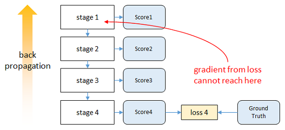
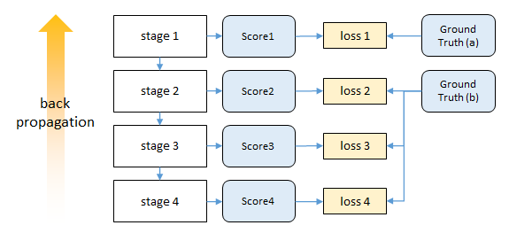

layout:     post
title:     openpose
subtitle:   人体动作识别论文阅读-姿态检测
date:       2017-12-08
author:     Mily
header-img: img/post-bg-cook.jpg
catalog: true
tags:

    - action recognition

姿态检测是动作识别领域的一个重要分支。本文介绍姿态识别一般方法，有自上而下和自下而上两种。本文着重讨论第二篇PAF。

1.单人姿态（自上而下）CPM

Wei, Shih-En “Convolutional Pose Machines.” CVPR 2016

2.多人姿态（自下而上）PAF

“Realtime Multi-person 2D Pose estimation using Part Affinity Fields”CVPR 2017

**存在问题:** 

1〉if person detector fails-> no recovery (人离得近的时候很容易检测不到）

2〉计算时间和人数有关，人越多越耗时。

## 模型分析：

第一阶段是一个基本的卷积网络，从彩色图像直接预测每个部件的响应。全身模型有18个部件，另外包含一个背景响应，共19层响应图。

第二阶段也是从彩色图像预测各部件响应

- 阶段性的卷积结果→ 纹理特征 

- 前一阶段各部件响应→ 空间特征

.png)

### 1.扩大感知域

### 2.中继监督优化

如果直接对整个网络进行梯度下降，输出层的误差经过多层反向传播会大幅减小，即发生**vanishing gradients**现象。

 

 为解决此问题，本文**在每个阶段的输出上都计算损失**。这种方法称为**intermediate supervision**，可以保证底层参数正常更新。 

### **3.多人姿态检测**

.png)

.png)

.png)

- #### **Confidence Maps for Part Detection**

**每个关节part都有一个相对于的置信图**

confidence map中每点的值与真值位置的距离有关，离得越近confidence 越高。

用高斯分布来描述，confidence峰值就是真值位置。

.png)

.png)

.png)

在test阶段，在预测的confidence maps上进行非极大值抑制来获得body part candidates.

NMS，简单的说，对于有相交的就选取其中置信度最高的一个作为最后结果，对于没相交的就直接保留下来，作为最后结果。

- #### **Part Affinity Fields for Part Association**

**人体部分亲和域**

.png)

.png)

.png)

.png)

- #### **Multi-Person Parsing using PAFs**

.png)

## 总结

本文中为优化增加了两个relaxation ：

1.选择最少的edges形成tree skeleton（骨骼）of human pose，而不使用整个的graph

2.把cliques partition problem 分解成一系列的bipartite matching subproblems，然后独立地分析adjacent tree nodes之间的匹配。

paper中论述了为什么采用**minimal greedy**的算法（取每一小步的最优组成最终的最优）也包含着global inference over multiple person,大致意思是因为CNN本身有比较广泛的感受野，所以global的信息也在里面了。（就将求整体graph最优，简化为了求两两part连接最优。只要单独算出来的每个limb是最优的，组合在一起就是最优的。）在这两个条件下，优化问题就简化成：

所以，通过公式（8）-（10）我们可以顺序获得每个limb（肢）的正确的correct candidates.然后把share 同一part的limb集合在一起就得到了full-body pose。找到两两body part 之间最优连接的问题：就变成了a maximum weight bipartite graph matching 的问题，如图4a。本paper使用**Hungarian algorithm**的匈牙利演算法。

参考

[【人体姿态】Convolutional Pose Machines](http://blog.csdn.net/shenxiaolu1984/article/details/51094959)

[Paper reading: Realtime Multi-person 2D Pose estimation using Part Affinity Fields(1)](http://blog.csdn.net/yengjie2200/article/details/68064095)

[Pose Machine PPT](https://www.slideshare.net/plutoyang/pose-machine)