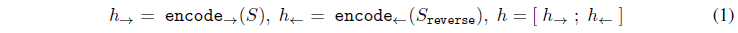

## **摘要：**

这两天非常火Google首款微信小程序“猜画小歌”：跟AI玩我画你猜的小游戏。这个游戏的背后，是一个名叫**Sketch-RNN**的项目。RNN就是循环神经网络，通常用来处理序列数据。而在简笔画这件事上，序列就是你的整个绘(tu)画(ya)过程。本篇论文就详细介绍了**Sketch-RNN的模型结构，训练过程和未来应用。**

## **模型结构：**

本文提出了一个能够生成常见物体简笔画的生成式[循环神经网络](https://en.wikipedia.org/wiki/Recurrent_neural_network)，其目标是以类似于人类的方式训练机器绘画和概括抽象概念。我们利用一个手绘简笔画的数据集训练我们的模型，其中每张简笔画表示握笔动作的一个序列：往哪个方向移动，什么时候提笔以及停笔。

模型 sketch-rnn 以 [sequence-to-sequence](https://research.google.com/pubs/pub43155.html) (seq2seq) 自编码器框架为基础。它融入了[变分推理](https://research.googleblog.com/2014/12/advances-in-variational-inference.html)，并将[超网络](https://research.google.com/pubs/pub45823.html)用作循环神经网络细胞。seq2seq 自编码器的目标是训练网络将输入序列编码成一个被称作*隐*向量的浮点数向量，并通过一个解码器尽可能接近地再现输入序列，从这一隐向量中重建输出序列。

.png)

.png)

### **无条件生成Unconditional Generation**

只使用decoder RNN模块，没有任何输入或者隐向量，隐藏节点初始化为0

.png)

### **有条件生成Conditional Generation**

.png)

**隐空间插值Latent Space Interpolation**

论文中，我们展示了通过将噪声引入编码器和解码器之间的通信通道中，让模型无法再准确地再现草图，而是必须学会以噪音隐向量的形式捕捉草图的本质。我们的解码器将使用这个隐向量生成用于构建新简笔画的一系列动作。在下图中，我们将几个表现真实的猫的样子的简笔画输入编码器中，以使用解码器生成重建的简笔画。需要强调的是，重建的猫简笔画***并不是对输入的简笔画的复制***，而是与输入的简笔画***具有相似特征的全新草图***。

.png)

受过猫简笔画训练的模型重建的简笔画

们是否可以使用这些特征来填充没有此类特征的其他简笔画，比如为一个猫头加上身体？例如，我们可以从整头猪的隐向量减去已编码的猪头的隐向量，从而得到一个表现身体概念的向量。将这一区别添加到猫头的隐向量中，从而得到一只完整的猫（即，猫头+身体=整只猫）。这些绘图类比让我们可以探索模型是如何组织其隐空间以在生成的众多简笔画中体现不同概念。

.png)

## **总结反思**

1.数据集推动科技发展，采集选择讲究技巧。这次小程序游戏的成功很大程度是因为采用了最新的大型草图数据集，而且在用户游戏涂鸦过程中也可以采集到大量数据标本，用于新一轮的训练。由于用户国籍不同，绘画风格不同，可以具有更好的泛化能力，帮助AI更加智能。

2.AI识图从绘画第一笔就开始预测并输出结果，这种高效率得益于seq2seq模型结构和训练过程（起笔落笔），其技术支持来源于本文提及的生成网络

3.同一种技术在不同的领域应用广泛。智能生成绘图、智能识图、教机器人绘画等等基于的技术类似，推动了其它创新应用的诞生，生成网络也是未来发展的热门方向。

### **未来应用**

1. 图案设计人员也可使用 sketch-rnn 生成大量相似却又独一无二的设计，以用于纺织品或者墙纸印刷。
2. 使用 sketch-rnn 的解码器模块作为独立模型，并训练它预测不完整简笔画的各种可能的结尾。通过建议完成不完整作品的备用方法，可将这一技术应用于通过模型协助艺术家进行创作。下图中，我们绘制了不同的不完整简笔画（红色的），并且让模型以不同的可能方式完善这些绘图。

**具体应用例子，欢迎体验：**[**autodraw**](https://www.autodraw.com/)    **与之类似的还有:**[**quickdraw**](https://quickdraw.withgoogle.com/)

.png)

### 参考

<https://developers.googleblog.cn/2017/04/blog-post.html>